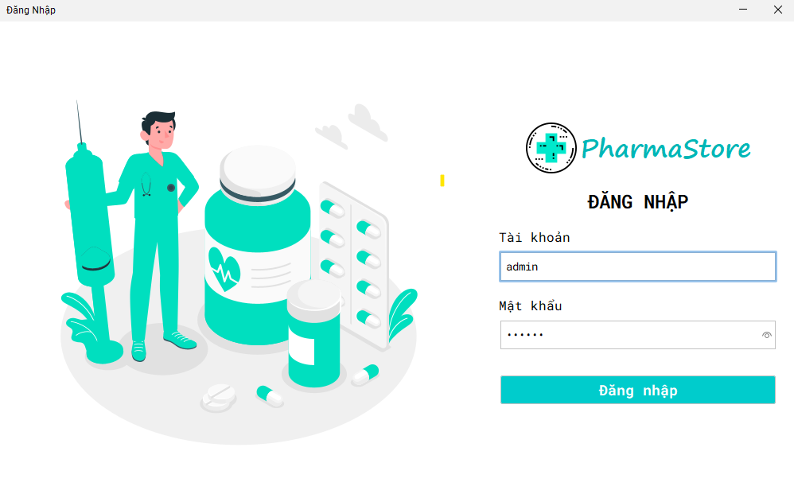
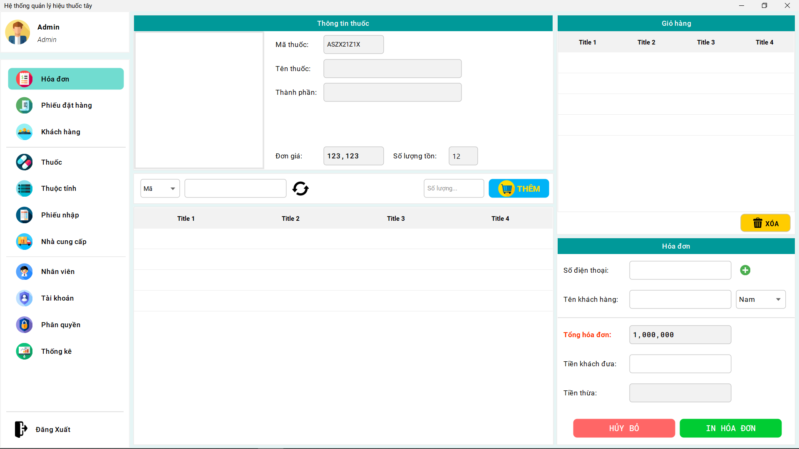

# IUH - Đại học Công nghiệp Thành phố Hồ Chí Minh

## Môn: Phát triển ứng dụng
## Đề tài: **Quản lý Hiệu Thuốc tây**

>Ý tưởng thiết kế UI: [Quản lý kho điện thoại - hgbaodev](https://github.com/hgbaodev/QuanLyKhoDienThoai)
>
## Technology
- Java
- SQL Server
- NetBeans 19

## Getting Started
1. Tải source code:
```sh
git clone git@github.com:atuandev/quan-ly-thuoc-tay.git
```
2. Import file **QLThuoc.sql** trong thư mục **database** vào **SQL Server**.
>Lưu ý: Phải đăng nhập SQL Server đúng tài khoản mật khẩu
>username: `sa`
>password: `sapassword`

3. Sử dụng **NetBeans** để Import project

## Giao diện 

### Đăng nhập


### Quản lý thuốc


### Hóa đơn

